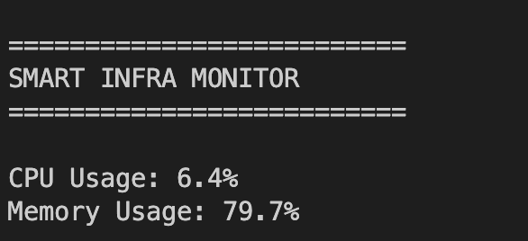

# Smart Infrastructure Monitoring System

A Python-based infrastructure monitoring and reliability system designed to monitor CPU and memory usage in real time.

## Features

- CPU Monitoring
- Memory Monitoring
- Alert Generation
- Log Storage
- Flask REST API Dashboard

## Technologies Used

- Python
- Flask
- psutil

## Run Project

Install dependencies:

pip install -r requirements.txt

Run monitor:

python main.py

Run dashboard:

python dashboard/app.py

## Terminal Monitoring
